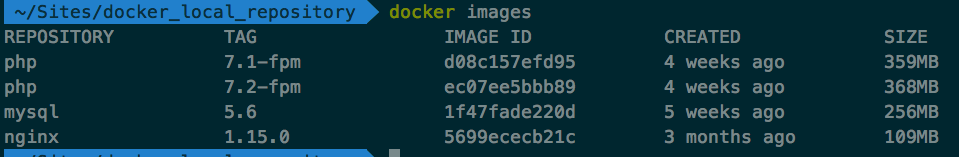

### Docker
***Docker 是一个开源的应用容器引擎，基于 Go 语言 并遵从Apache2.0协议开源。***

***Docker 可以让开发者打包他们的应用以及依赖包到一个轻量级、可移植的容器中，然后发布到任何流行的 Linux 机器上，也可以实现虚拟化。***

***容器是完全使用沙箱机制，相互之间不会有任何接口（类似 iPhone 的 app）,更重要的是容器性能开销极低。***

#### 基本概念
##### 1.镜像--images

a、Image类似于虚拟机镜像，可以理解为一个面向Docker引擎的只读模板，包含了文件系统。

b、Image是创建Docker容器的基础。通过版本管理和增量的文件系统，Docker提供了一套十分简单 的机制来创建和更新现有的镜

##### 2.容器--container
a、Container类似于一个轻量级的沙箱，Docker利用容器来运行和隔离应用。

b、Container是从Image创建的应用运行实例，可以将其启动、开始、停止、删除，而这些 Container都是相互隔离、互不可见的。

c、Container可以看做一个简易版的Linux系统环境，以及运行在其中的应用程序打包而成的应用盒子。

d、镜像自身是只读的。Container从Image启动的时候，Docker会在镜像的最上层创建一个可写层，镜像本身将保持不变。

##### 3.仓库(Repository)
a、Repository类似于代码仓库，是Docker集中存放镜像文件的场所。

***注：注册服务器和Docker仓库不一样，注册服务器是存放仓库的地方***


### Docker 安装mysql

#### 首先，我们从仓库拉取一个MySql的镜像
```
docker pull mysql:5.6
```
mysql:5.6   冒号后面的数字，叫做 TAG，和版本的概念类似，查看可下载的TAG，可以在这里：
https://hub.docker.com/r/library/


点击某个软件，可以查看TAG列表


#### 通过命令 docker images 查看我们刚刚拉下来的mysql的镜像


*可以看到拉取的所有镜像*

#### 接下来，运行并启动一个容器
```
docker run -d -p 3307:3306 -e MYSQL_ROOT_PASSWORD=xy123456 --name docker_mysql mysql:5.6
```
```
-d 让容器在后台运行 
-p 添加主机到容器的端口映射 ,冒号前 是本机端口，冒号后是容器端口
-e 设置环境变量，这里是设置mysql的root用户的初始密码，这个必须设置 
–name 容器的名字，随便取，但是必须唯一
```

#### 通过命令docker ps -a 查看刚刚创建的容器
```
docker ps -a
```


可以看到我的容器状态的Up状态，表示容器正在运行，并且把可以看到主机和容器的端口映射关系。

如果只查看运行中的容器，则`docker ps`

#### 进入到我们刚刚创建的容器中，输入命令
```
docker exec -ti docker_mysql /bin/bash
```
```
-t 在容器里生产一个伪终端 
-i 对容器内的标准输入 (STDIN) 进行交互
```
***容器中默认是没有vim的，所以首先要安装vim,需要注意的是安装前记得先执行apt update命令，不然安装会出现问题。***

***进入到mysql容器后，通过创建一个远程可以访问的用户，这样能从别的主机访问到数据库了。「其实直接用root登录也是没问题的」***

### Docker安装php-fpm
#### 拉取php-fpm的镜像
```
docker pull php:7.1-fpm
```
#### 再创建一个php的容器
```
docker run -d -v /Users/xxx/Sites:/var/www/html -p 9000:9000 --link docker_mysql:mysql --name docker_phpfpm71 php:7.1-fpm
```
```
-d 让容器在后台运行 
-p 添加主机到容器的端口映射 
-v 添加目录映射，即主机上的/Users/xxx/Sites和容器中/var/www/html目录是同步的 
–name 容器的名字 
–link 与另外一个容器建立起联系，这样我们就可以在当前容器中去使用另一个容器里的服务。
```
***如果不指定–link参数其实也是可以得，因为容易本身也是有ip的且唯一，所以也可以直接利用ip去访问容器***

### docker安装php扩展
进入容器操作
```
docker-php-ext-install pdo_mysql
```
### docker安装nginx
#### 拉取一个nginx镜像
```
docker pull ngixn:1.15.0
```
#### 运行nginx榕溪
```
docker run -d -p 9091:80 -v /User/lidan/Sites:/var/www/html --link docker_phpfpm71:phpfpm --name docker_nginx nginx:1.15.0
```
```
-d 让容器在后台运行 
-p 添加主机到容器的端口映射 
-v 添加目录映射,这里最好nginx容器的根目录最好写成和php容器中根目录一样。但是不一点非要一模一样,如果不一样在配置nginx的时候需要注意 
–name 容器的名字 
–link 与另外一个容器建立起联系
```

#### 进入nginx容器，修改nginx的配置文件让它支持php
```
docker exec -ti docker_nginx /bin/bash
```
```
-t 在容器里生产一个伪终端 
-i 对容器内的标准输入 (STDIN) 进行交互
```
#### 在容器里找到nginx的配置文件，默认是在/etc/nginx目录下
```
location ~ \.php$ {
        root           /var/www/html;
        fastcgi_index  index.php;
        fastcgi_pass   docker_phpfpm71:9000;//这里改成我们之前--link进来的容器，也可以直接用php容器的ip
        fastcgi_param  SCRIPT_FILENAME $document_root$fastcdi_script_name;//如果你的根目录和php容器的根目录不一样，这里的$document_root需要换成你php下的根目录，不然php就找不到文件了
    }
```

