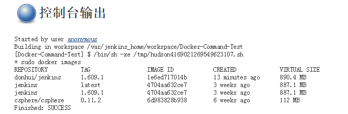

# docker-jenkins
running docker in jenkins in docker，在（Docker里的）Jenkins里运行Docker

##使用##
####1、从Github拉取源码####
git clone https://github.com/donhui/docker-jenkins.git
####2、构建镜像####
docker build -t myname/jenkins:1.609.1 docker-jenkins/Dockerfile
####3、基于镜像运行容器（注意把docker.sock和docker映射到jenkins容器里）####
docker run -d --name myjenkins -v /var/run/docker.sock:/var/run/docker.sock -v $(which docker):/usr/bin/docker -p 8080:8080 myname/jenkins:1.609.1
####4、Jenkins创建JOB，构建步骤选择Execute shell，内容为：sudo docker images，构建后日志输出如下：####
 

##refer##
- [jenkins官方镜像](https://github.com/jenkinsci/docker)
- [running-docker-in-jenkins-in-docker](http://container-solutions.com/running-docker-in-jenkins-in-docker/)
- [running-docker-in-jenkins-in-docker中文翻译版](http://www.dockone.io/article/431)
