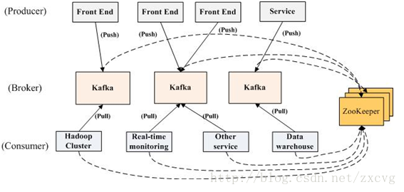

微云（可快速扩充）
====================

数据传输-介绍[不同的容器满足不同渠道的消息时间需求] 
---------------------

kafka是一种高吞吐量的分布式发布订阅消息系统，她有如下特性：

* 升级到 kafka0.9测试ok
* 通过O(1)的磁盘数据结构提供消息的持久化，这种结构对于即使数以TB的消息存储也能够保持长时间的稳定性能。
* 高吞吐量：即使是非常普通的硬件kafka也可以支持每秒数十万的消息。
* 支持通过kafka服务器和消费机集群来分区消息。
* 支持Hadoop并行数据加载。

卡夫卡的目的是提供一个发布订阅解决方案，它可以处理消费者规模的网站中的所有动作流数据。 这种动作（网页浏览，搜索和其他用户的行动）是在现代网
络上的许多社会功能的一个关键因素。 这些数据通常是由于吞吐量的要求而通过处理日志和日志聚合来解决。 对于像Hadoop的一样的日志数据和离线分析系
统，但又要求实时处理的限制，这是一个可行的解决方案。kafka的目的是通过Hadoop的并行加载机制来统一线上和离线的消息处理，也是为了通过集群机来
提供实时的消费。

### 常用场景1 实时消息传递

> 从flume获取数据,放到指定的topic；(配置文件使用约定link-name:kafka1)
>
> 使用console获取消费者数据，从指定的topic；
>
> ## 获取数据

数据采集-运行示例1
---------------------
### 构造镜像包
> 进入到当前目录
> ## fig build
### 运行
> 进入到当前目录
> ## fig up -d && fig ps
### 观察日志

> 建立kafka topic
>
> kafka-topics.sh --create --zookeeper 192.168.59.103:2181 --replication-factor 1 --partitions 1 --topic mykafka
>
> 生产数据
>
> telnet 192.168.59.103 44447
>
> 消费数据
>
> kafka-console-consumer.sh --zookeeper 192.168.59.103:2181 --topic mykafka --from-beginning
>
> ok,数据到消费端显示出来
>
> ## flume+kafka示例

数据采集-spring调用示例2
---------------------
### 构造镜像包
> 进入到当前目录
> ## fig build
### 运行
> 进入到当前目录
> ## fig up -d && fig ps
### 观察日志

> 下载源码：git clone https://github.com/supermy/spring-kafka-demo
>
> 修改地址：consumer_context.xml 192.168.59.103
> 修改地址：context.xml 192.168.59.103
> 运行测试类，查看spring对kafka的调用结果。com.colobu.spring_kafka_demo.Producer  com.colobu.spring_kafka_demo.Consumer
>
> ## spring+kafka示例

数据采集-kafka自带示例3
---------------------
### 自带示例代码
> 将数据从kafka服务器推送道儿HDFS：kafka/0.8.1.1/libexec/contrib/hadoop-consumer；
> 将数据推送到kafka服务器：/kafka/0.8.1.1/libexec/contrib/hadoop-producer
> 建议：可以用flume直接采集进Hbase.
>
> 代码示例1:数据的生产和消费：https://github.com/supermy/kafka0.8-examples
>    更改地址为192.168.59.103:2181 192.168.59.203
>    先创建topic kafka-topics.sh --create --zookeeper 192.168.59.103:2181 --replication-factor 1 --partitions 1 --topic topic1
>    先创建topic kafka-topics.sh --create --zookeeper 192.168.59.103:2181 --replication-factor 1 --partitions 1 --topic topic2
>    先创建topic kafka-topics.sh --create --zookeeper 192.168.59.103:2181 --replication-factor 1 --partitions 1 --topic topic3
>   SimpleConsumerDemo,两个多线程生产数据，同时获取topic2/topic2的数据。
>   KafkaConsumerProducerDemo,一个线程生产，一个线程消费，都是topic的数据。
>
> ## kafka示例

Volume只有在下列情况下才能被删除：
该容器可以用docker rm －v来删除且没有其它容器连接到该Volume（以及主机目录是也没被指定为Volume）。注意，-v是必不可少的。
docker run中使用rm参数
