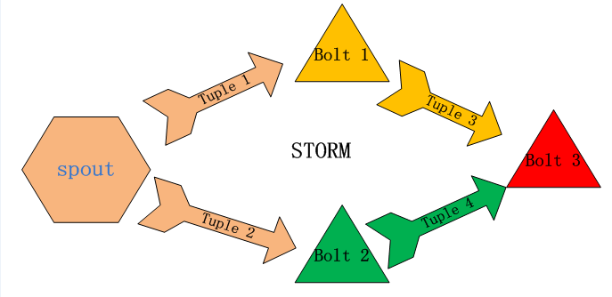

微云（可快速扩充）
====================

实时数据分析-storm
---------------------

Storm可以方便地在一个计算机集群中编写与扩展复杂的实时计算，Storm用于实时处理，就好比 Hadoop 用于批处理。Storm保证每个消息都会得到处理，而且它很
快——在一个小集群中，每秒可以处理数以百万计的消息。更棒的是你可以使用任意编程语言来做开发。
Storm的主要特点如下：
* 简单的编程模型。类似于MapReduce降低了并行批处理复杂性，Storm降低了进行实时处理的复杂性。
* 可以使用各种编程语言。你可以在Storm之上使用各种编程语言。默认支持Clojure、Java、Ruby和Python。要增加对其他语言的支持，只需实现一个简单的Storm通
信协议即可。
* 容错性。Storm会管理工作进程和节点的故障。
* 水平扩展。计算是在多个线程、进程和服务器之间并行进行的。
* 可靠的消息处理。Storm保证每个消息至少能得到一次完整处理。任务失败时，它会负责从消息源重试消息。
快速。系统的设计保证了消息能得到快速的处理，使用ØMQ作为其底层消息队列。
* 本地模式。Storm有一个“本地模式”，可以在处理过程中完全模拟Storm集群。这让你可以快速进行开发和单元测试。
* Storm集群由一个主节点和多个工作节点组成。主节点运行了一个名为“Nimbus”的守护进程，用于分配代码、布置任务及故障检测。每个工作节 点都运行了一个名为
“Supervisor”的守护进程，用于监听工作，开始并终止工作进程。Nimbus和Supervisor都能快速失败，而且是无 状态的，这样一来它们就变得十分健壮，两者的协
调工作是由ApacheZooKeeper来完成的。
* Storm的术语包括Stream、Spout、Bolt、Task、Worker、Stream Grouping和Topology。Stream是被处理的数据。Spout是数据源。Bolt处理数据。Task是运
行于Spout或Bolt中的 线程。Worker是运行这些线程的进程。Stream Grouping规定了Bolt接收什么东西作为输入数据。数据可以随机分配（术语为Shuffle），或
者根据字段值分配（术语为Fields），或者 广播（术语为All），或者总是发给一个Task（术语为Global），也可以不关心该数据（术语为None），或者由自定义逻辑
来决定（术语为 Direct）。Topology是由Stream Grouping连接起来的Spout和Bolt节点网络。在Storm Concepts页面里对这些术语有更详细的描述。

### 环境设置 ***注意：首先设定***
> 启动服务：fig up -d && fig ps.
>
> 查看服务状态：http://192.168.59.103:8088/index.html
>
> http://storm.apache.org/documentation/Setting-up-a-Storm-cluster.html
> vi ~/.storm/storm.yaml
> nimbus.host: "192.168.59.103"
>
### 常用场景1 storm自带示例
>
> storm自带示例运行测试：
> cd /Applications/apache-storm-0.9.4/examples/storm-starter
> mvn compile exec:java -Dstorm.topology=storm.starter.WordCountTopology
> mvn package
> mvn compile exec:java -Dstorm.topology=storm.starter.WordCountTopology
> storm jar target/storm-starter-0.9.4-jar-with-dependencies.jar storm.starter.RollingTopWords
> storm jar target/storm-starter-0.9.4-jar-with-dependencies.jar storm.starter.RollingTopWords production-topology remote
>
> ## 查看状态

### 常用场景2 kafka实时获取数据并处理
>
>
> 1.启动flume-kafka的producer
>   1.1 启动服务：fig up -d && fig ps.
>   1.2 按mytools/common/mykafka/的数据采集-运行示例1的步骤启动；
>   1.3 先创建topic：
>       kafka-topics.sh --create --zookeeper 192.168.59.103:2181 --replication-factor 1 --partitions 1 --topic storm-sentence
>   1.3 生产数据：telnet 192.168.59.103 44450
>
> 2.启动Topology作为Kafka的comsumer( -c nimbus.thrift.port=49627)
>   2.1 git clone https://github.com/supermy/storm-kafka-0.8-plus-test.git/
>   2.2 mvn package
>   2.3 运行示例
>   java -cp storm-kafka-0.8-plus-test-0.2.0-SNAPSHOT-jar-with-dependencies.jar storm.kafka.KafkaSpoutTestTopology 192.168.59.103:2181
>   java -cp target/storm-kafka-0.8-plus-test-0.2.0-SNAPSHOT-jar-with-dependencies.jar storm.kafka.trident.SentenceAggregationTopology 192.168.59.103:2181
> 3.观察Storm数据处理情况
>
> ## 日志输出到屏幕
